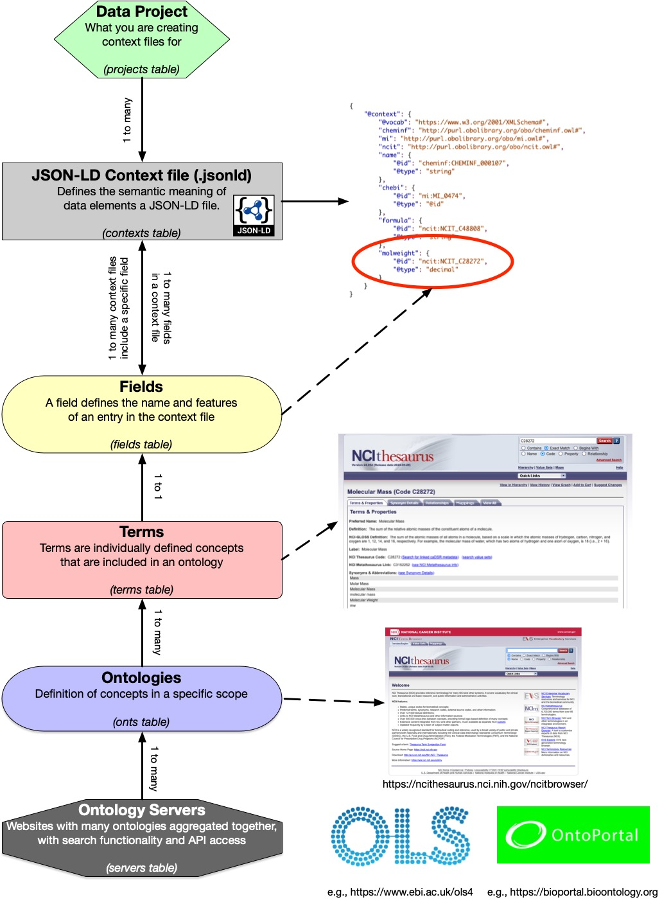

## SciContext: A JSON-LD Context File Development System
This project is a web-based processing system, built in Django, to manage the creation of [JSON-LD](https://json-ld.org/) and publishing 
of JSON-LD context files. As JSON-LD files are an encoding of the resource description framework ([RDF](https://www.w3.org/TR/rdf11-schema/)), context 
files are needed to provide the semantic annotation of (the meaning) data defined in a JSON-LD file, thus allowing them
to be converted into RDF [triples](https://en.wikipedia.org/wiki/Semantic_triple).

This application can be used with any JSON-LD data, however it was developed with the SciData framework data format in 
mind, that encourages creating context files for metadata elements in a specific knowledge domain (i.e. a minimal 
metadata standard) which can be reused in multiple places, published as a standard, and then be used across different 
disciplines, as needed.

Additionally, this application allows the publication of the context files created, by publishing them to the GitHub 
pages branch of your GitHub repository, so that the files can be managed and published easily in one system.

### How the system is set up
As there are many ontologies that have been developed, there are many places online that you need to know about. 
Thankfully, there are now some centralized websites where ontologies are not only aggregated, but also indexed and 
searchable. SciContext takes advantage of these ontology 'lookup' servers as the source of the defined concepts 
in the ontologies they aggregate.

On the other side context files for JSON-LD documents have sort of abstract as in of themselves they are not so useful.
However, in order for JSON-LD files to be converted accurately into RDF they are critical and so writing and publishing 
them 

