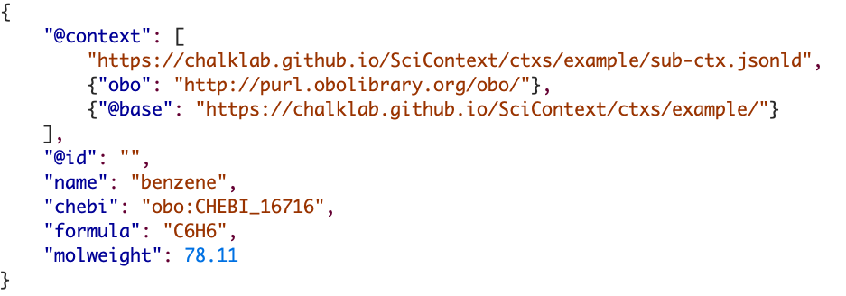
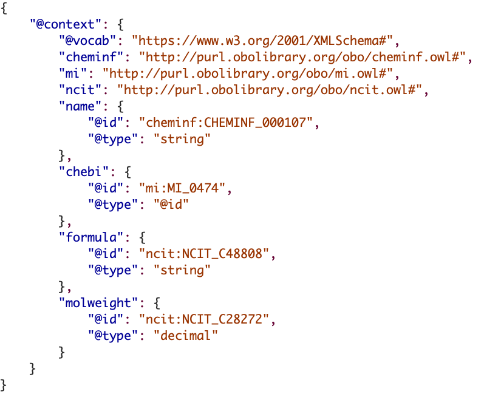

Below is a small example of how a JSON-LD context file works, when loaded at the top of a JSON-LD data file.

In the data file above there are four pieces of data about a chemical compounds: name, formula, molecular weight and 
"[chebi](https://www.ebi.ac.uk/chebi/searchId.do?chebiId=CHEBI:16716)", a semantic identifier for benzene. Looking at
this information (as humans do) we understand what the first three are as we understand the meaning of the data labels
(and we have learned about ChEBI we it also).  However, in this JSON-LD file the data is just text and thus there is no
representation of the meaning in the file... unless we add meaning by defining semantically what each data element
means.  The JSON-LD file below defines the meaning for each of the data elements above, and includes statements defining
the datatye of each element.

To prove this works and produces valid RDF you can use the JSON-LD Playground to convert the file to RDF in different 
formats.  You can see this my clicking this [link](https://tinyurl.com/2mkhg6f4). The RDF that is produced is 
(shortened for clarity):

`<https://chalklab.github.io/SciContext/ctxs/example/> <obo:cheminf.owl#CHEMINF_000107> "benzene"^^<xsd:string> .
<https://chalklab.github.io/SciContext/ctxs/example/> <obo:mi.owl#MI_0474> <obo:CHEBI_16716> .
<https://chalklab.github.io/SciContext/ctxs/example/> <obo:ncit.owl#NCIT_C28272> "7.811E1"^^<xsd:decimal> .
<https://chalklab.github.io/SciContext/ctxs/example/> <obo:ncit.owl#NCIT_C48808> "C6H6"^^<xsd:string> .
`